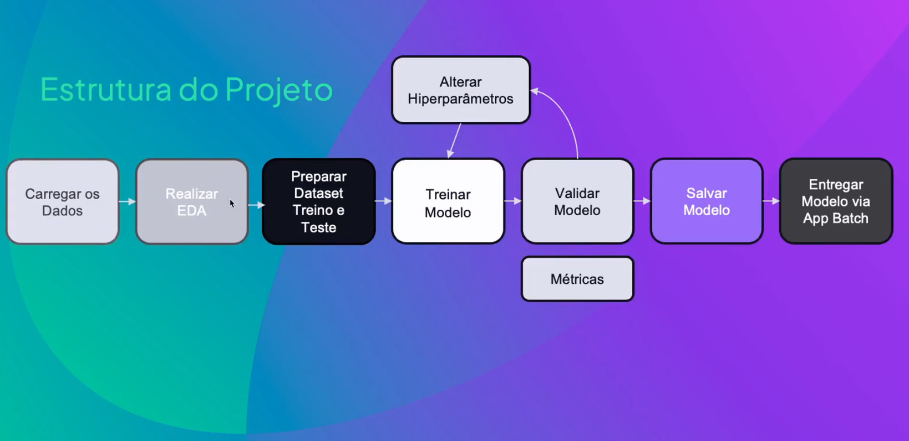
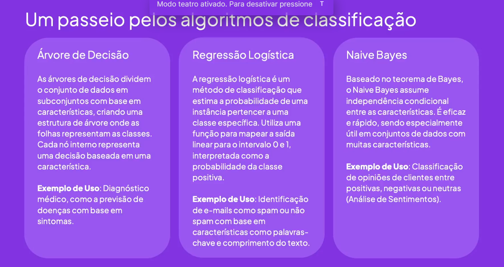
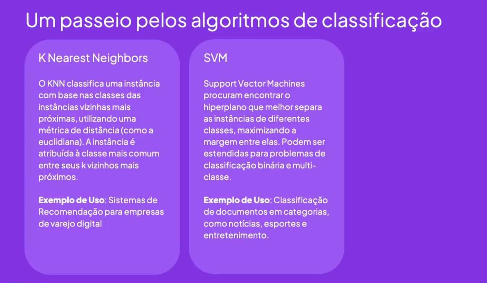
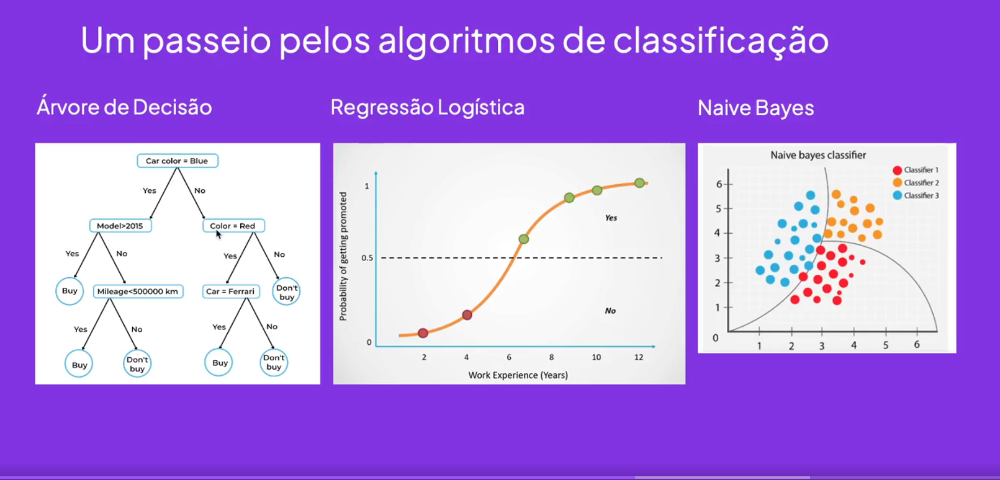
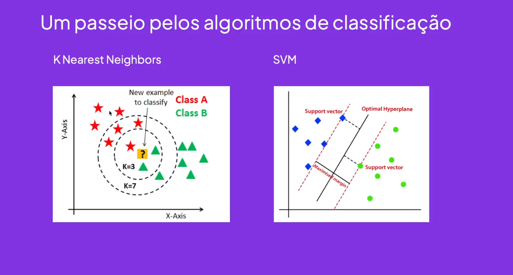
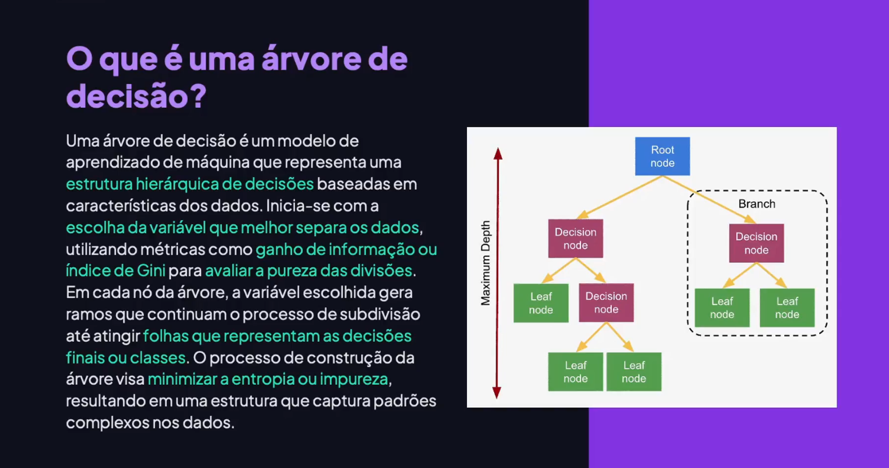
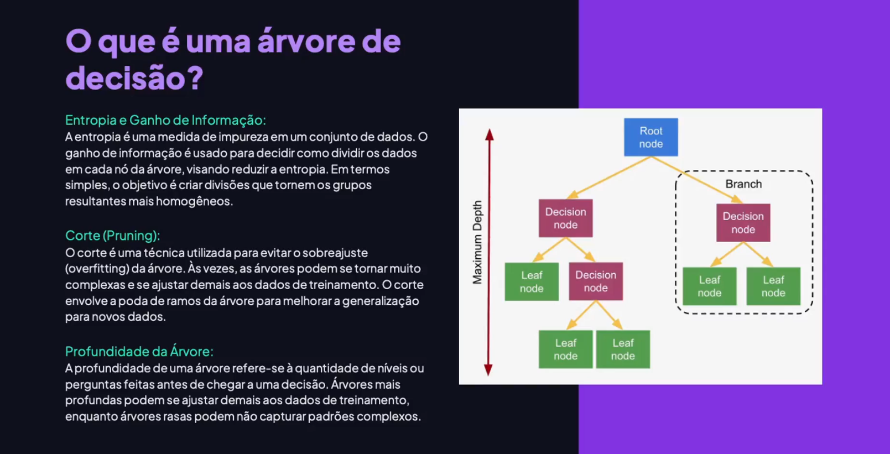
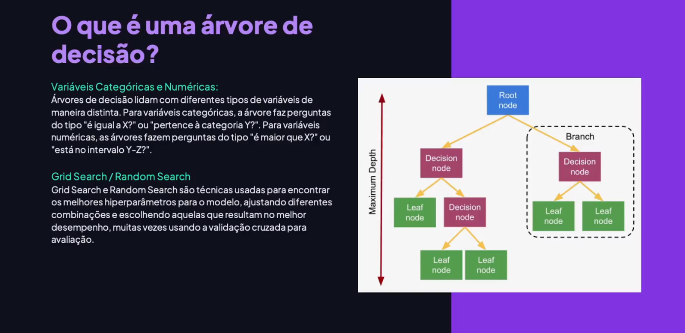
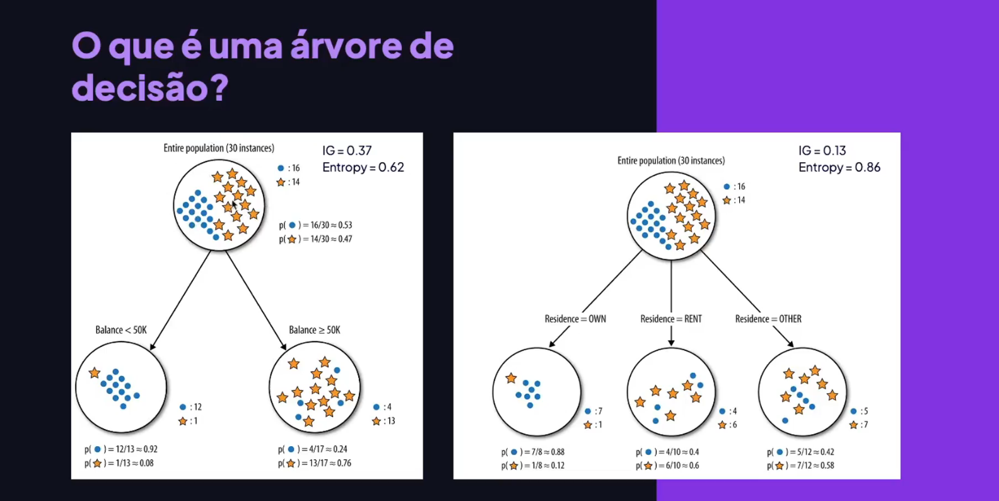

<!-- markdownlint-disable MD033 -->

# Módulo 10 - Classificação Árvore de Decisão

> [voltar](./notes.md) para a página anterior

## Sumário

- [Módulo 10 - Classificação Árvore de Decisão](#módulo-10---classificação-árvore-de-decisão)
  - [Sumário](#sumário)
  - [Projeto](#projeto)
    - [Etapas](#etapas)
  - [Material](#material)

## Projeto

  

### Etapas

  

## Material

**Conceito:**

  

**Resumo de alguns tipos de algoritimos de classificação (parte-1):**

  

**Resumo de alguns tipos de algoritimos de classificação:**

  

**Exemplos gráficos tipos de algoritimos de classificação (parte-1):**

  

**Exemplos gráficos tipos de algoritimos de classificação (parte-2):**

  

**Arvore de Decisão:**

  

  

  

**Exemplo de Árvore de Decisão:**

  

> [retornar](#módulo-10---classificação-árvore-de-decisão) ao topo da página
>
> [voltar](./notes.md) para a página anterior
