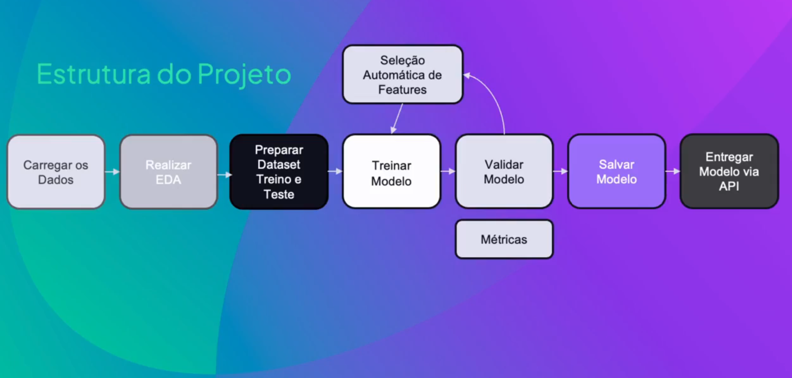
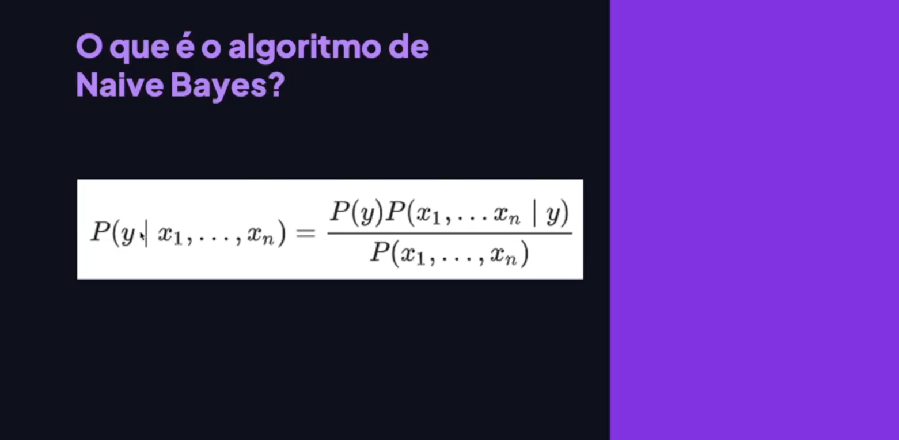
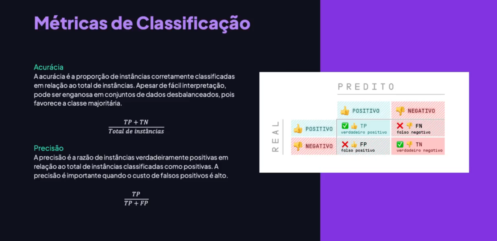
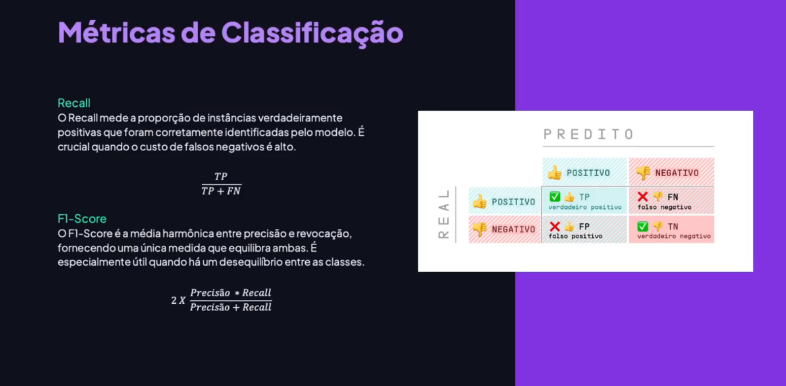
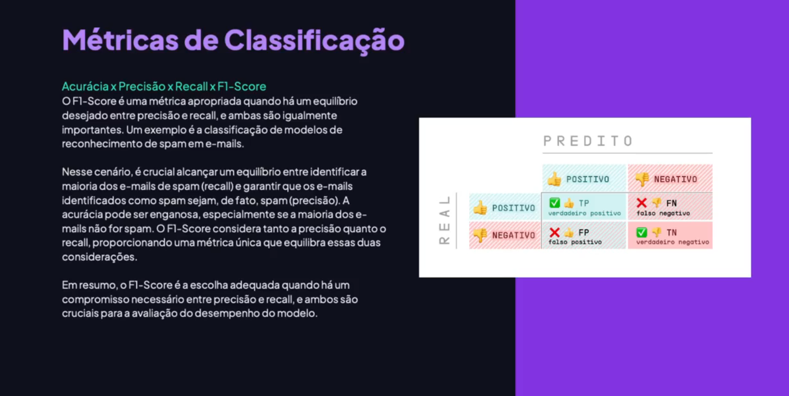

<!-- markdownlint-disable MD033 -->

# Módulo 11 - Classificação Naive Bayes

> [voltar](./notes.md) para a página anterior

## Sumário

- [Módulo 11 - Classificação Naive Bayes](#módulo-11---classificação-naive-bayes)
  - [Sumário](#sumário)
  - [Projeto](#projeto)
    - [Descrição](#descrição)
    - [Etapas](#etapas)
  - [Material](#material)
    - [Conceitos e Fórmulas](#conceitos-e-fórmulas)
    - [Métricas de Classificação](#métricas-de-classificação)

## Projeto

### Descrição

Neste módulo, vamos desenvolver um projeto de previsão de obesidade em uma clínica de endocrinologia. Utilizaremos um conjunto de dados de um estudo sobre obesidade, onde os participantes preencheram um formulário com hábitos de saúde e informações pessoais. A ideia é criar um classificador binário usando o algoritmo de Naive Bayes para prever se um paciente é obeso ou não com base nas respostas do formulário. O questionário não inclui informações como peso e altura, então vamos tentar estimar a condição de obesidade apenas com base nos hábitos. Vamos carregar os dados, explorar as variáveis, preparar o conjunto de treinamento e teste, treinar o modelo e validar usando métricas adequadas. Também faremos a seleção automática de features para identificar quais características são mais importantes na predição da obesidade. Por fim, salvaremos o modelo e o disponibilizaremos via API.

  

### Etapas

  

## Material

Neste módulo, vamos explorar o **algoritmo Naive Bayes**, que é baseado em probabilidade condicional e independência de variáveis. Vamos abordar desde o conceito do algoritmo até a entrega do modelo através de uma API. A agenda do módulo inclui uma explicação detalhada do Naive Bayes, métricas de classificação e um projeto prático em Python. Vamos explorar todo o processo, desde a análise exploratória de dados até a seleção automática de *features*.

### Conceitos e Fórmulas

O algoritmo de Naive Bayes é um método de aprendizado de máquina que faz previsões com base no teorema de Bayes. Ele assume que as características usadas para fazer a previsão são independentes entre si, o que é uma simplificação. O algoritmo é amplamente utilizado em classificação de texto, como filtragem de spam, e é eficiente e fácil de implementar para conjuntos de dados grandes. A fórmula da probabilidade condicional é usada para calcular a probabilidade de um evento ocorrer dado que outro evento já ocorreu. No contexto do *machine learning*, o Naive Bayes é expresso como a probabilidade de uma variável target dado um conjunto de variáveis preditoras.

  

  

  

  

  

  

### Métricas de Classificação

A acurácia é a proporção de instâncias corretamente classificadas em relação ao total de instâncias, mas pode ser enganosa em conjuntos de dados desbalanceados. A precisão mede a proporção de instâncias verdadeiramente positivas em relação ao total de instâncias classificadas como positivas, sendo útil quando o custo dos falsos positivos é alto. O recall mede a proporção de instâncias verdadeiramente positivas identificadas pelo modelo, sendo crucial quando o custo dos falsos negativos é alto. O F1-score é uma média harmônica entre precisão e recall, útil quando há um equilíbrio entre as duas métricas.

  

  

  

  

  

> [retornar](#módulo-11---classificação-naive-bayes) ao topo da página
>
> [voltar](./notes.md) para a página anterior
