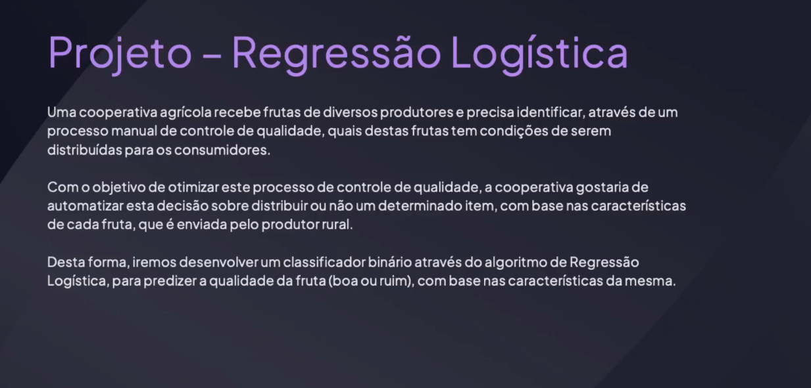
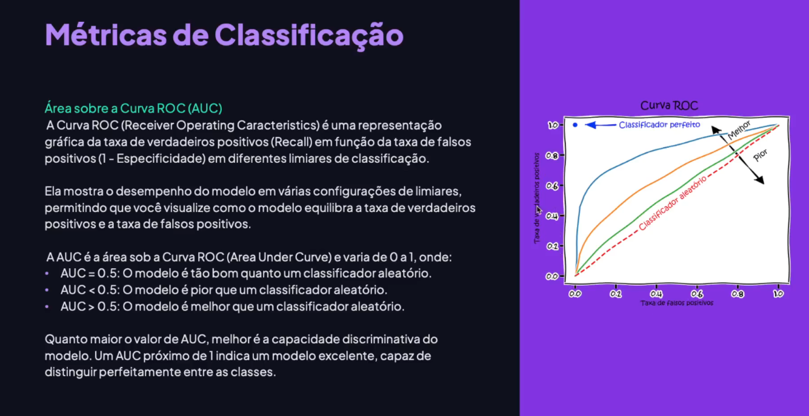

<!-- markdownlint-disable MD033 -->

# Módulo 12 - Regressão Logística

> [voltar](./notes.md) para a página anterior

## Sumário

- [Módulo 12 - Regressão Logística](#módulo-12---regressão-logística)
  - [Sumário](#sumário)
  - [Projeto](#projeto)
    - [Descrição](#descrição)
    - [Etapas](#etapas)
  - [Material](#material)
    - [Conceitos e Fórmulas](#conceitos-e-fórmulas)
    - [Métricas de Classificação](#métricas-de-classificação)

## Projeto

### Descrição

Neste projeto prático de regressão logística, vamos desenvolver um classificador binário para prever a qualidade das frutas recebidas por uma cooperativa agrícola. A ideia é automatizar o processo de controle de qualidade, utilizando características das frutas fornecidas pelos produtores. Vamos carregar os dados, realizar uma análise exploratória, preparar o conjunto de treinamento e teste, treinar e validar o modelo. Além disso, faremos a otimização de hiperparâmetros, validaremos métricas como a curva ROC e a área sob a curva ROC, e salvaremos o modelo. Em seguida, faremos algo diferente: entregaremos o modelo através de uma API em um container DOC, permitindo que seja distribuído em qualquer ambiente com essa tecnologia. Vamos começar com o código agora.

  

### Etapas

  

## Material

O objetivo deste modulo é apresentar o algoritmo de **Regressão Logística**, usado amplamente para classificação binária e multiclasse que entrega, além da classição, a **probabilidade da instância pertencer a classe de interesse**. Como de costume, faremos um projeto prático completo, otimização de hiperparâmetros até a entrega do modelo através de uma API de Conteiner Docker.

### Conceitos e Fórmulas

O algoritmo de regressão logística é um algoritmo de aprendizado supervisionado usado para problemas de classificação binária. Ele modela a probabilidade de uma amostra pertencer a uma classe específica. A função sigmoide é usada para calcular essa probabilidade, que é derivada da regressão linear. Um threshold é definido para classificar as instâncias em classes positivas ou negativas. A função logit é o inverso da sigmoide e está relacionada ao conceito de chance. O treinamento do modelo envolve encontrar os coeficientes que minimizam os erros de predição, usando a função de erro de entropia cruzada binária.

  

  

  

  

  

  

  

  

### Métricas de Classificação

A métrica chamada AUC (Área Sob a Curva ROC) foi tulizada para avaliar o desempenho de um modelo de classificação. A Curva ROC é uma representação gráfica da taxa de verdadeiros positivos em relação à taxa de falsos positivos em diferentes limites de classificação. Quanto mais próxima a curva estiver da linha diagonal, pior é o classificador. A AUC varia de 0 a 1, onde 0,5 indica um classificador aleatório e 1 indica um classificador perfeito. Vamos utilizar essa métrica em nosso projeto prático para avaliar a capacidade do modelo em distinguir entre as classes.

  

> [retornar](#módulo-12---regressão-logística) ao topo da página
>
> [voltar](./notes.md) para a página anterior
