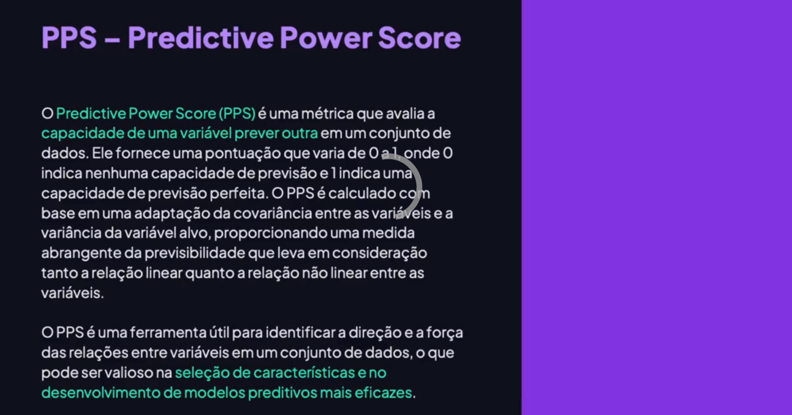
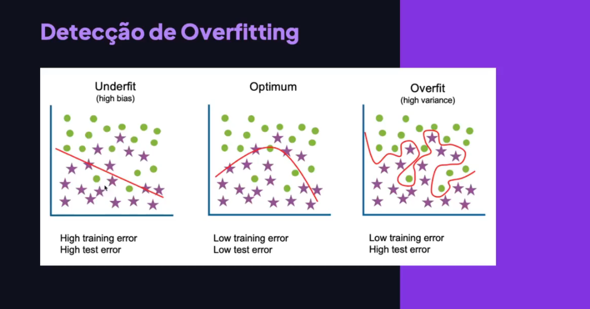
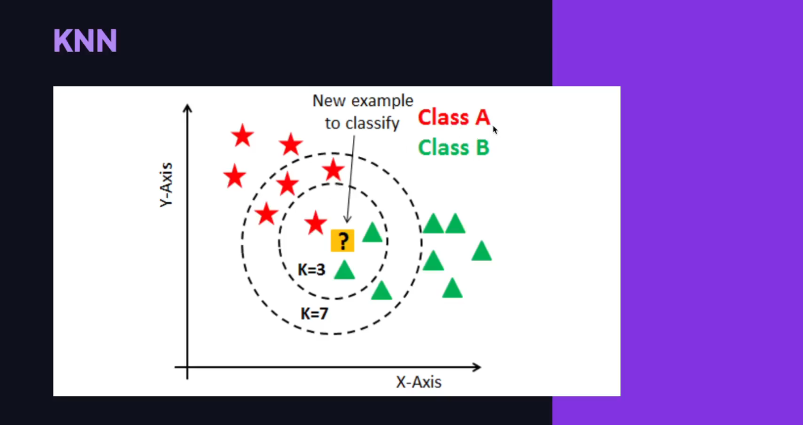
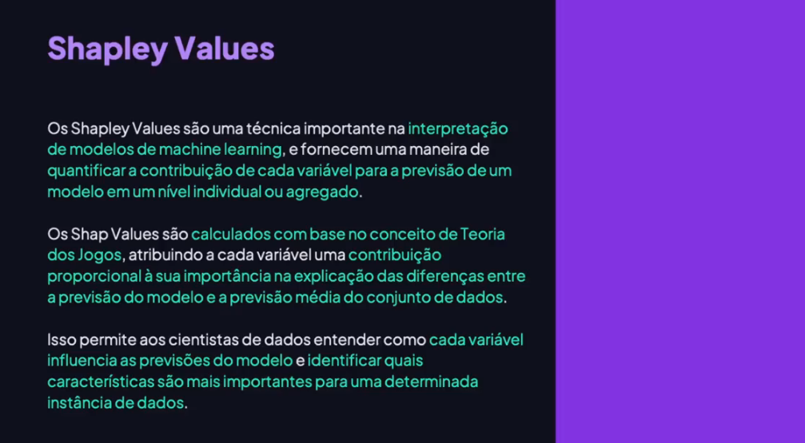

<!-- markdownlint-disable MD033 -->
<!-- markdownlint-disable MD024 -->

# Módulo 13 - Tópicos Complementares

> [voltar](./notes.md) para a página anterior

## Sumário

- [Módulo 13 - Tópicos Complementares](#módulo-13---tópicos-complementares)
  - [Sumário](#sumário)
  - [Projeto](#projeto)
  - [Tópicos](#tópicos)
    - [PPS - Predictive Power Score](#pps---predictive-power-score)
      - [Descrição](#descrição)
      - [Por que e para que aplicar OneHotEnconding em variáveis categóricas?](#por-que-e-para-que-aplicar-onehotenconding-em-variáveis-categóricas)
      - [Calculando matrix de PPS entre variáveis](#calculando-matrix-de-pps-entre-variáveis)
    - [Seleção de FEatures](#seleção-de-features)
      - [Descrição](#descrição-1)
    - [Detecção de Overfitting](#detecção-de-overfitting)
      - [Descrição](#descrição-2)
      - [Algorítimo KNN](#algorítimo-knn)
    - [Regularização](#regularização)
      - [Descrição](#descrição-3)
    - [Shapley Values](#shapley-values)
      - [Descrição](#descrição-4)

## Projeto

Vamos explorar técnicas que podem ser incorporadas nos algoritmos supervisionados para torná-los mais robustos. Essas técnicas têm várias finalidades, como mitigar o overfitting, aprimorar a seleção de features, identificar relações entre variáveis e obter uma interpretação mais profunda dos modelos. Com essas técnicas, vocês poderão melhorar significativamente o desempenho e a eficácia dos seus modelos, além de obter insights valiosos dos dados analisados.

## Tópicos

### PPS - Predictive Power Score

#### Descrição

O PPS (Predictive Power Score) é uma métrica que avalia a capacidade de uma variável prever outra em um conjunto de dados. Ao contrário da correlação, o PPS fornece uma pontuação de 0 a 1, indicando a capacidade de previsão. Ele leva em consideração tanto a relação linear quanto a não-linear entre as variáveis. O PPS é útil para identificar a força e a direção das relações entre as variáveis, o que é importante na seleção de características e no desenvolvimento de modelos preditivos. Ao contrário da correlação, a direção da previsão pode ser diferente entre as variáveis.

<div>
  
</div>

#### Por que e para que aplicar OneHotEnconding em variáveis categóricas?

Aplicamos o One-Hot Encoding nas variáveis categóricas para representá-las de forma numérica, o que é muitas vezes necessário para que algoritmos de aprendizado de máquina possam trabalhar com esses dados. Aqui estão algumas razões principais:

1. **Compatibilidade com algoritmos de aprendizado de máquina**: Muitos algoritmos de aprendizado de máquina, como regressão linear, árvores de decisão e redes neurais, requerem que os dados de entrada sejam numéricos. Ao converter variáveis categóricas em uma representação numérica, podemos aplicar esses algoritmos sem problemas.

2. **Preservação da informação**: O One-Hot Encoding cria uma representação binária onde cada categoria única em uma variável categórica é transformada em uma coluna binária (0 ou 1). Isso preserva a informação sobre a categoria original sem impor nenhuma ordem ou hierarquia entre elas.

3. **Evita distorções de interpretação**: Se usarmos simplesmente a codificação ordinal (atribuindo números inteiros às categorias), os algoritmos de aprendizado de máquina podem interpretar erroneamente que há uma relação ordinal entre as categorias, o que nem sempre é verdadeiro ou desejável.

4. **Melhora o desempenho do modelo**: Ao converter variáveis categóricas em uma representação numérica adequada, o modelo pode aprender mais facilmente os padrões nos dados, o que pode levar a um melhor desempenho preditivo.

No entanto, é importante estar ciente de que o One-Hot Encoding pode aumentar a dimensionalidade do conjunto de dados, especialmente se houver muitas categorias únicas em uma variável categórica. Isso pode levar a problemas de dimensionalidade, especialmente em conjuntos de dados grandes. Além disso, em árvores de decisão ou métodos baseados em árvores, a criação de muitas variáveis binárias pode aumentar o tempo de treinamento e a complexidade do modelo.

O método `get_dummies()` automatiza o processo de conversão de variáveis categóricas em variáveis dummy, também conhecidas como variáveis indicadoras ou variáveis binárias.

Aqui está um exemplo simples usando Pandas:

```python
import pandas as pd

# Criando um DataFrame de exemplo
data = {'Cidade': ['Nova York', 'Los Angeles', 'Chicago', 'Chicago', 'Nova York']}
df = pd.DataFrame(data)

# Aplicando o get_dummies() para criar variáveis dummy
dummy_variables = pd.get_dummies(df['Cidade'])

# Concatenando as variáveis dummy ao DataFrame original
df = pd.concat([df, dummy_variables], axis=1)

print(df)
```

Output:

```shell
        Cidade  Chicago  Los Angeles  Nova York
0    Nova York        0            0          1
1  Los Angeles        0            1          0
2      Chicago        1            0          0
3      Chicago        1            0          0
4    Nova York        0            0          1
```

Neste exemplo, a coluna 'Cidade' foi convertida em três colunas de variáveis dummy: 'Chicago', 'Los Angeles' e 'Nova York'. Cada linha possui um valor de 1 na coluna correspondente à cidade e 0 nas outras, indicando a presença ou ausência dessa categoria. Isso é útil para análise e modelagem de dados com algoritmos de aprendizado de máquina.

#### Calculando matrix de PPS entre variáveis

O índice Predictive Power Score (PPS) é uma medida estatística que permite avaliar a relação de previsão entre duas variáveis. Ele é útil para identificar quais variáveis podem ter maior poder de previsão em relação a outras. Aqui está como você pode calcular o PPS entre variáveis de um DataFrame usando a biblioteca `ppscore` em Python

```python
import pandas as pd
import ppscore as pps

# Criando um DataFrame de exemplo
data = {
    'variavel1': [1, 2, 3, 4, 5],
    'variavel2': [5, 4, 3, 2, 1],
    'variavel3': [1, 3, 5, 7, 9]
}
df = pd.DataFrame(data)

# Calculando o PPS entre todas as variáveis do DataFrame
pps_matrix = pps.matrix(df)

print(pps_matrix)
```

Este código calculará a matriz de PPS entre todas as variáveis no DataFrame. O resultado será uma tabela que mostra o PPS entre cada par de variáveis. Quanto mais próximo o PPS estiver de 1, mais forte é a relação de previsão entre as duas variáveis.

> [retornar](#módulo-13---tópicos-complementares) ao topo da página

### Seleção de FEatures

#### Descrição

Abordamos o tema de seleção de features em algoritmos supervisionados. A seleção de features é importante para melhorar a precisão e eficiência dos modelos de IA. Ao identificar e selecionar as features mais relevantes, podemos reduzir a dimensionalidade dos dados, mitigar o impacto de features irrelevantes ou redundantes e melhorar a capacidade de generalização dos modelos. Além disso, a seleção adequada de features facilita a interpretabilidade do modelo e aumenta a confiança nas previsões. Vamos explorar diferentes métodos de seleção de features, como filtros estatísticos, wrapper methods, embedded methods e redução de dimensionalidade. Também veremos exemplos práticos no código.

<div>
  
</div>

<div>
  
</div>

> [retornar](#módulo-13---tópicos-complementares) ao topo da página

### Detecção de Overfitting

#### Descrição

Falaramo sobre como detectar e evitar o overfitting em modelos de Machine Learning e AI. O overfitting ocorre quando um modelo se ajusta excessivamente aos dados de treinamento, mas não tem um bom desempenho em dados novos. Isso pode acontecer devido à complexidade do modelo, variáveis irrelevantes ou treinamento excessivo. Para evitar o overfitting, podemos aplicar técnicas como regularização, validação cruzada e simplificação do modelo. Vamos visualmente identificar modelos ótimos, com baixo erro de treinamento e teste, e modelos com underfitting e overfitting.

<div>
  
</div>

<div>
  
</div

<div>
  
</div>

#### Algorítimo KNN

O algoritmo K-NN, ou K-Nearest Neighbors, é um método utilizado para classificação e regressão. Ele funciona com base na ideia de que instâncias de dados semelhantes estão próximas umas das outras em um espaço de características. Quando um novo ponto de dado é introduzido, o K-NN identifica os K pontos de dados mais próximos e determina sua classificação ou previsão com base na agregação dos valores ou classes desses vizinhos mais próximos. A escolha do valor de K e da métrica de distância é crucial para o desempenho do algoritmo. O K-NN é conhecido por sua simplicidade e eficácia em problemas de baixa a moderada dimensionalidade.

<div>
  
</div>

<div>
  
</div

<div>
  
</div>

**Conceito ChatGPT 3.5:**

O algoritmo K-NN (K-Vizinhos Mais Próximos) é um método de classificação supervisionada que é amplamente utilizado em aprendizado de máquina. Ele é usado para classificar um novo ponto de dados com base na maioria dos pontos de dados vizinhos a ele. O "K" no K-NN refere-se ao número de vizinhos mais próximos que serão considerados para tomar uma decisão de classificação.

A ideia básica por trás do K-NN é que os pontos de dados pertencentes à mesma classe tendem a agrupar-se próximos uns dos outros no espaço de características. Portanto, a classe de um novo ponto de dados é determinada pela classe dominante entre seus vizinhos mais próximos.

Por exemplo, suponha que você tenha um conjunto de dados que contém informações sobre diferentes tipos de frutas, como maçãs e laranjas, com base em características como cor e tamanho. Usando o algoritmo K-NN, você pode classificar uma nova fruta como uma maçã ou uma laranja com base na maioria das frutas vizinhas mais próximas em termos de cor e tamanho.

Aplicabilidades do algoritmo K-NN incluem:

1. **Classificação de documentos**: Classificar documentos com base em seu conteúdo textual comparando-os com documentos semelhantes previamente classificados.

2. **Recomendação de produtos**: Recomendar produtos para usuários com base nas preferências de produtos de usuários semelhantes.

3. **Diagnóstico médico**: Auxiliar no diagnóstico médico, classificando pacientes com base em seus sintomas e histórico médico comparado a pacientes semelhantes.

4. **Reconhecimento de padrões**: Reconhecer padrões em dados, como padrões de tráfego para prever congestionamentos de tráfego.

5. **Detecção de anomalias**: Identificar anomalias em sistemas, como detecção de fraudes em transações financeiras com base em padrões de transações fraudulentas anteriores.

O K-NN é um algoritmo simples e intuitivo, mas pode ser computacionalmente caro para grandes conjuntos de dados, já que exige o cálculo das distâncias entre o novo ponto de dados e todos os outros pontos de dados existentes. Além disso, a escolha do valor de "K" pode afetar significativamente o desempenho do algoritmo.

> [retornar](#módulo-13---tópicos-complementares) ao topo da página

### Regularização

#### Descrição

A regularização é uma técnica importante para prevenir o overfitting em modelos de aprendizado de máquina. Ela adiciona um termo de penalização à função de custo do modelo, incentivando coeficientes menores e reduzindo a complexidade do modelo. Existem diferentes formas de regularização, como o L1 (Lasso), que seleciona automaticamente características relevantes, e o L2 (RIDGE), que suaviza o ajuste do modelo. O ElasticNet combina os efeitos do L1 e L2, enquanto o LARS lida com a inclusão de mais variáveis do que observações. O Group Lasso penaliza grupos de características relacionadas. Vamos explorar o Lasso e o Ridge no código.

<div>
  
</div>

<div>
  
</div>

<div>
  
</div>

<div>
  
</div>

> [retornar](#módulo-13---tópicos-complementares) ao topo da página

### Shapley Values

#### Descrição

Abordamos o Shapley Values, que é uma técnica importante para interpretar modelos de Machine Learning. Shapley Values quantifica a contribuição de cada variável na previsão de um modelo, tanto individualmente quanto em conjunto. Ele é calculado com base na teoria dos jogos e permite que os cientistas de dados entendam como cada variável influencia as previsões do modelo. Isso é útil para identificar padrões e melhorar o modelo. Vamos ver mais detalhes no código.

<div>
  
</div>

> [retornar](#módulo-13---tópicos-complementares) ao topo da página
>
> [voltar](./notes.md) para a página anterior
