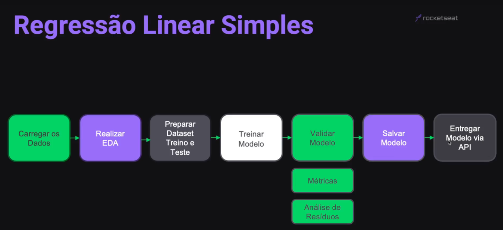
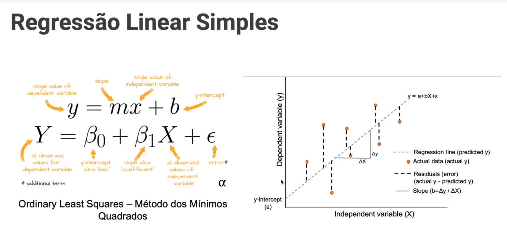

<!-- markdownlint-disable MD033 -->

# Módulo 7 - Regressão Linear Simples

## Projeto

### Descrição

Uma plataforma online de educação, que consegue acompanhar a quantidade de horas que seus alunos passam estudando numa determinada trilha, deseja avaliar se esta quantidade de horas influencia na pontuação do teste final. Para isso, iremos treinar um algoritmo de regressão linear, de forma que seja possível prever a pontuação do teste final, dada a quantidade de horas de estudo.

### Etapas

  

### Ilustração - Regressão Linear

  

> [voltar](./notes.md) para a página anterior
