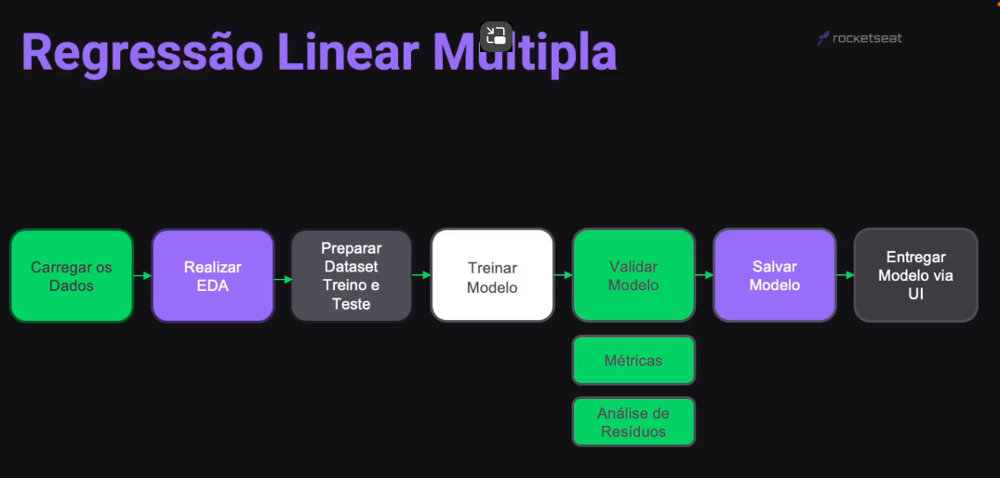
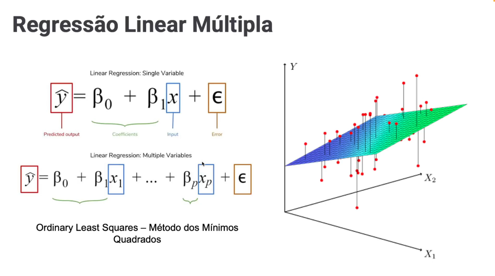

<!-- markdownlint-disable MD033 -->

# Módulo 8 - Regressão Linear Múltipla

## Projeto

### Descrição

Um laboratório de análises clínicas que conduz testes de colesterol, deseja avaliar, com base em caracteríticas, dos pacientes, tais como idade, nível de atividade física, peso, dentre outras, se estas variáveis influenciam no resultado do exame de colesterol total. Para isso, iremos treinar um algoritimo de regressão linear múltipla, de forma que seja possível prever o resultado do exame de colesterol, dada as caracteríticas do paciente.

### Etapas

  

### Ilustração - Regressão Linear Múltipla

  

### Conceitos

#### O que é **Bucketing**?

Dentro do contexto de análise exploratória de dados, o termo "bucketing" refere-se à prática de agrupar valores em intervalos específicos, também conhecidos como "buckets" ou "bins". Esse processo é comumente utilizado para simplificar a análise de dados contínuos, tornando-a mais compreensível e interpretável.

A aplicação do bucketing é especialmente útil quando se lida com variáveis numéricas contínuas que possuem uma ampla gama de valores. Ao agrupar esses valores em intervalos discretos, é possível obter uma visão mais clara de padrões, tendências e distribuições nos dados. Isso facilita a identificação de insights e padrões significativos.

Por exemplo, imagine que você tenha um conjunto de dados contendo idades de uma população. Em vez de analisar cada idade individualmente, você pode criar buckets, como 0-10, 11-20, 21-30, e assim por diante. Isso permite visualizar a distribuição das idades de uma maneira mais fácil de entender, fornecendo uma visão geral das faixas etárias predominantes na população.

O bucketing é comumente usado em combinação com gráficos de histograma, que representam a distribuição de frequências dos dados em cada intervalo. Essa técnica é valiosa para simplificar dados complexos e destacar padrões que podem não ser imediatamente evidentes ao examinar os valores brutos.

#### O que é Homocedasticidade?

A homocedasticidade é um conceito estatístico que se refere à constância da variabilidade dos erros em um modelo de regressão ao longo de todas as diferentes valores da variável independente. Em termos mais simples, a homocedasticidade implica que a dispersão dos resíduos (diferenças entre os valores observados e os valores preditos pelo modelo) é constante em todos os níveis da variável explicativa.

Em um modelo de regressão, a presença de homocedasticidade é importante porque sugere que a variabilidade dos erros é constante em todos os níveis da variável independente. Se a homocedasticidade não for atendida e houver heterocedasticidade (variabilidade dos erros que varia em diferentes níveis da variável independente), isso pode comprometer a validade estatística dos resultados da regressão.

Para avaliar a homocedasticidade, os pesquisadores geralmente examinam gráficos de resíduos em relação às variáveis independentes. Se a dispersão dos resíduos aumenta ou diminui de maneira sistemática à medida que a variável independente aumenta, pode indicar a presença de heterocedasticidade.

Em resumo, a homocedasticidade é uma suposição importante em modelos de regressão que influencia a precisão das estimativas e inferências derivadas desses modelos.

> [voltar](./notes.md) para a página anterior
