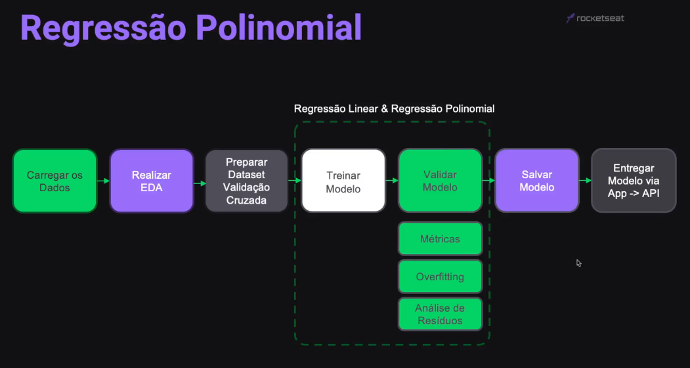
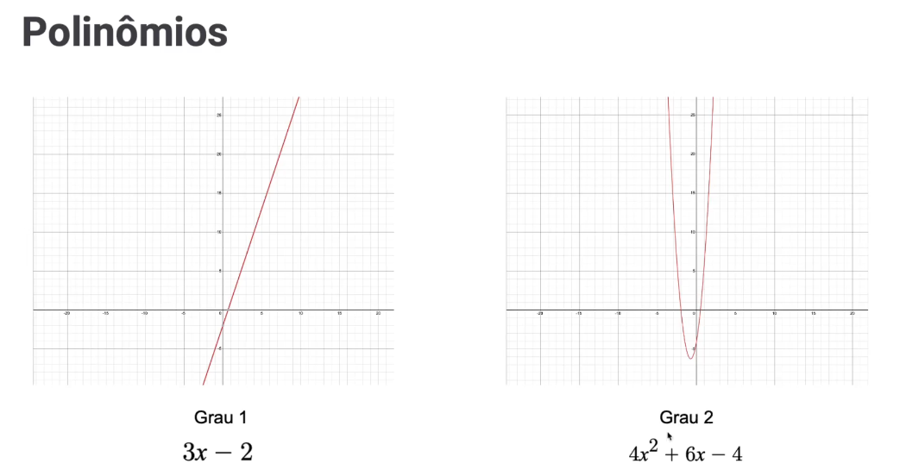
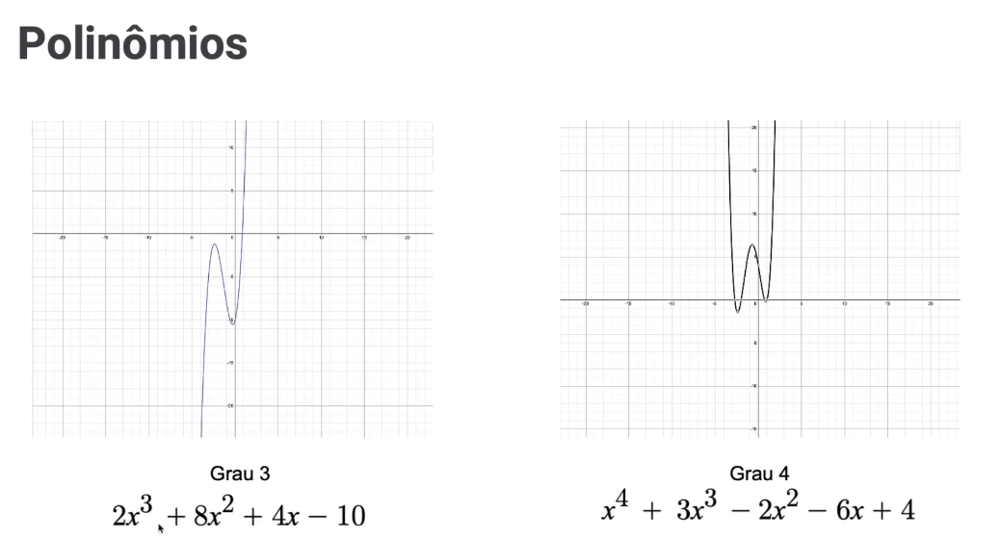
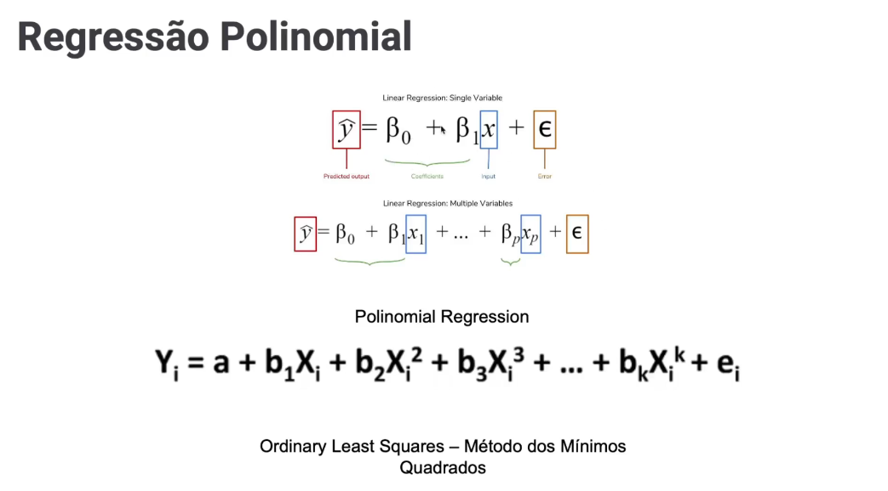
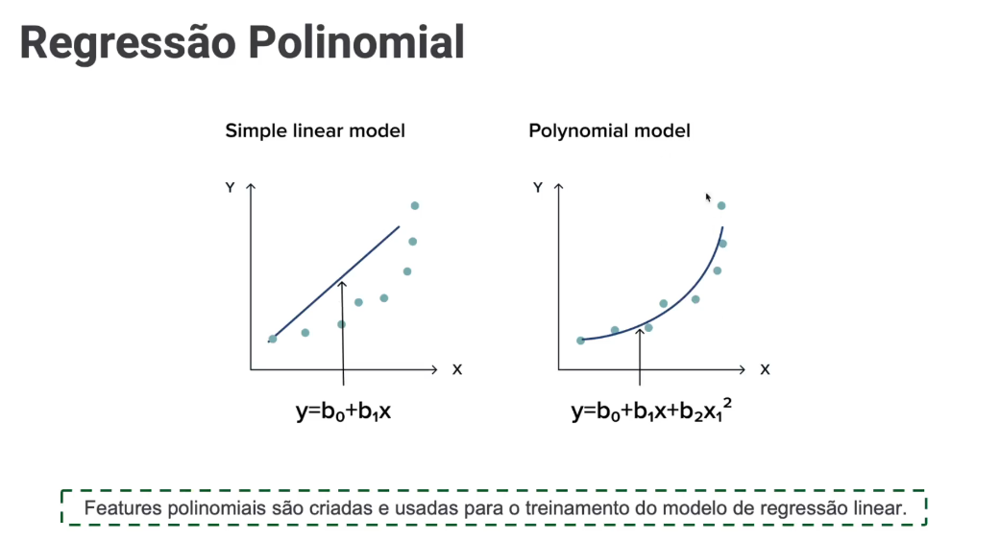

<!-- markdownlint-disable MD033 -->

# Módulo 9 - Regressão Polinomial

## Projeto

### Descrição

A área de RH de uma empresa possui informação de tempo de casa e nível profissional de seus colaboradores e deseja entender quais fatores influenciam em seus salários. Para isso, iremos treinar um **algoritmo de regressão polinomial** de forma que seja possível prever o salário do profissional, dado seu tempo de casa e nível profissional.

### Etapas

  

## Conceitos

### Polinômios

Um polinômio é uma expressão matemática que envolve variáveis, constantes e operações de adição, subtração e multiplicação. Geralmente, é uma soma de termos, cada termo sendo o produto de uma constante (coeficiente) e uma potência inteira não negativa de uma variável. A forma geral de um polinômio é:

$$ P(x) = a_n x^n + a_{n-1} x^{n-1} + \ldots + a_2 x^2 + a_1 x + a_0 $$

Aqui, $P(x)$ é o polinômio, $a_n, a_{n-1}, \ldots, a_1, a_0$ são os coeficientes, $x$ é a variável e $n$ é o grau do polinômio (a maior potência à qual a variável está elevada).

Por exemplo, o polinômio $P(x) = 3x^2 - 2x + 1$ é um polinômio de segundo grau, pois a maior potência de $x$ é 2.

Os polinômios podem ter diferentes graus, que são determinados pelo maior expoente na variável. Eles são usados em várias áreas da matemática e da física para modelar relações e fenômenos, sendo fundamentais em equações algébricas, interpolação, análise numérica e muitos outros contextos.

Os polinômios são fundamentais em diversas áreas da matemática e ciências, sendo usadas para modelar relações, resolver equações e descrever padrões numéricos.

#### Exemplors Gráficos

  

 

  

### Regressão Polinomial

A regressão polinomial é um método utilizado em algoritmos supervisionados de aprendizado de máquina, especialmente na análise de regressão, para modelar a relação entre variáveis independentes e dependentes. Em vez de assumir uma relação linear entre as variáveis, a regressão polinomial permite que o modelo se ajuste a um polinômio de grau superior.

Em termos mais simples, enquanto a regressão linear ajusta uma linha reta aos dados, a regressão polinomial ajusta uma curva polinomial. A fórmula geral para um modelo de regressão polinomial de grau $n$ é dada por:

$$ y = a_n x^n + a_{n-1} x^{n-1} + \ldots + a_2 x^2 + a_1 x + a_0 $$

onde $y$ é a variável dependente, $x$ é a variável independente, e $a_0, a_1, \ldots, a_n$ são coeficientes a serem determinados pelo algoritmo de aprendizado.

A regressão polinomial permite capturar relações mais complexas entre as variáveis, tornando-se útil quando a relação não é estritamente linear. No entanto, é importante ter cautela ao escolher o grau do polinômio, pois um grau muito alto pode resultar em sobreajuste (*overfitting*), levando a um modelo que se ajusta muito bem aos dados de treinamento, mas não generaliza bem para novos dados.

O processo de ajuste de um modelo de regressão polinomial geralmente envolve a otimização dos coeficientes do polinômio para minimizar a diferença entre os valores previstos e os valores reais da variável dependente nos dados de treinamento. Isso é feito através de técnicas como o método dos mínimos quadrados.

A regressão polinomial é uma ferramenta versátil e pode ser aplicada em diversas áreas, incluindo previsão de séries temporais, modelagem de fenômenos físicos complexos e análise de dados experimentais.

  

 

  

 

> [voltar](./notes.md) para a página anterior
